<!-- Generated by scripts/readme.mjs — edit the text there, not here. -->

  <a href="https://nyxon.tech/en/people/emad-habibnia"></a>

🌐 <a href="https://github.com/Emadhabibnia1385">English</a> · <a href="https://github.com/Emadhabibnia1385/Emadhabibnia1385/blob/main/README.fa.md">فارسی</a> · <a href="https://github.com/Emadhabibnia1385/Emadhabibnia1385/blob/main/README.ru.md">Русский</a> · <b>العربية</b> · <a href="https://github.com/Emadhabibnia1385/Emadhabibnia1385/blob/main/README.zh.md">中文</a>

  
  
  

### مرحبًا، أنا عماد 👋

أؤمن أن المنتج الجيد لا يُبنى بالكود وحده؛ بل يجمع <b>الأفكار والناس والتصميم والبنية التحتية</b>. من هذه الرؤية وُلدت <b>[NYXON](https://nyxon.tech/ar)</b>، استوديو برمجيات في مصنع الابتكار في مشهد، أسّسته مع [بارسا أميرآبادي](https://github.com/Parsa5436) و[محمد سعيد بابائي](https://github.com/qqsaeedpp). نبني منتجات ويب وتجارب ذكاء اصطناعي وأتمتة — <i>أنظمة تعمل بينما أنت نائم.</i>

أبني بوتات تيليجرام وتطبيقاتها المصغّرة (Mini Apps)، وأدوات للأعمال الصغيرة، وأنظمة أتمتة، وخوادم لينكس تُبقي كل ذلك يعمل. منتجي الرئيسي حاليًا هو <b>[Seamless](https://seamless.nyxon.tech/)</b>، منصة للبيع عبر تيليجرام.

 

## ◆ أعمال مختارة

<table>
  <tr>
    <td width="50%"><a href="https://github.com/Emadhabibnia1385/KasbBook">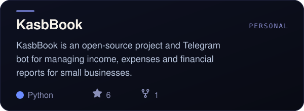</a></td>
    <td width="50%"><a href="https://github.com/Emadhabibnia1385/GymCore">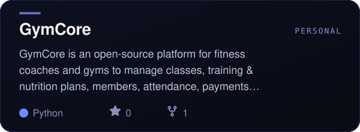</a></td>
  </tr>
  <tr>
    <td width="50%"><a href="https://github.com/Emadhabibnia1385/ExpiryHub">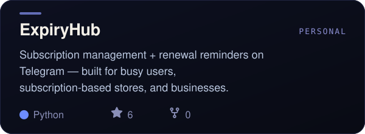</a></td>
    <td width="50%"><a href="https://github.com/Emadhabibnia1385/GorfeYar">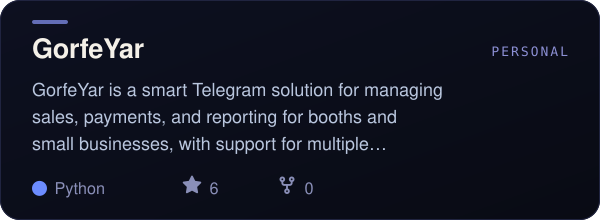</a></td>
  </tr>
  <tr>
    <td width="50%"><a href="https://github.com/nyxon-tech/claude-switcher">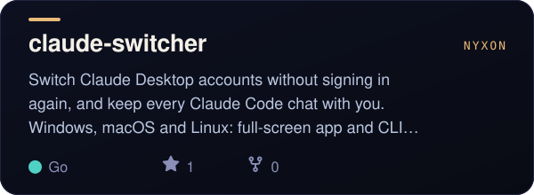</a></td>
    <td width="50%"><a href="https://github.com/nyxon-tech/poolak-sdk">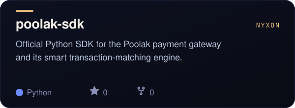</a></td>
  </tr>
  <tr>
    <td width="50%"><a href="https://github.com/Emadhabibnia1385/ConfigFlow">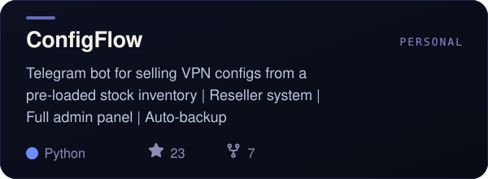</a></td>
    <td width="50%"><a href="https://github.com/Emadhabibnia1385/xui-backup-web">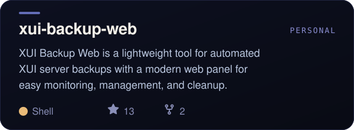</a></td>
  </tr>
</table>

<a href="https://github.com/Emadhabibnia1385?tab=repositories">← جميع المستودعات</a>

 

## ◆ الأدوات

  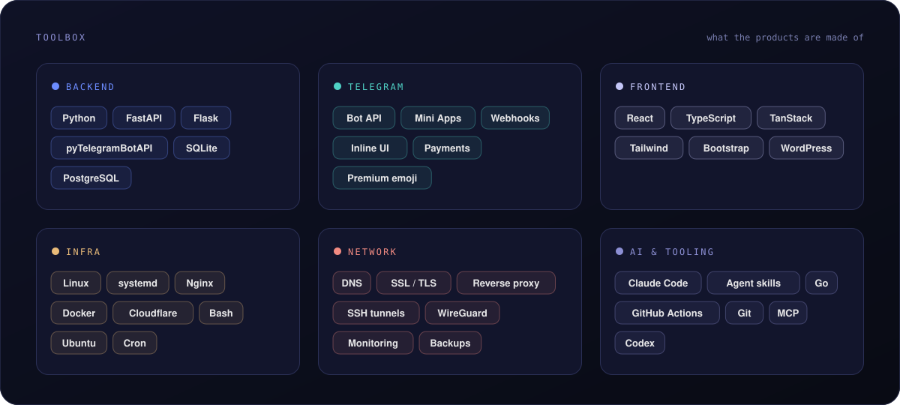

  

 

## ◆ بالأرقام

  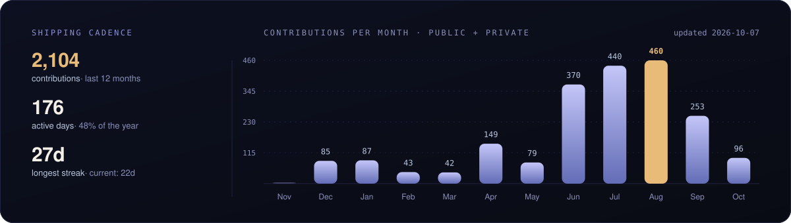

  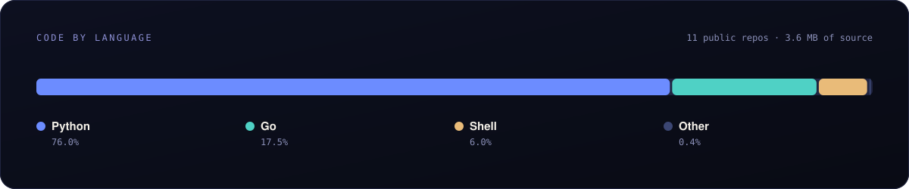

  <picture>
    <source media="(prefers-color-scheme: dark)" srcset="https://raw.githubusercontent.com/Emadhabibnia1385/Emadhabibnia1385/output/snake-dark.svg">
    
  </picture>

 

## ◆ تواصل معي

  
  
  
  
  

<code>☾</code> فكّر · ابنِ · أطلق — أنظمة تعمل بينما أنت نائم.

