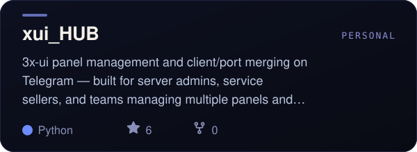

<!-- Profile README — github.com/Emadhabibnia1385/Emadhabibnia1385
     Data-driven SVGs (activity, languages, project cards) are rebuilt daily by .github/workflows/refresh.yml -->

  

  
  
  
  
  

I believe a good product is built from more than code — it brings together **ideas, people, design and infrastructure**. That belief became **[NYXON](https://nyxon.tech/)**, a software studio at the Mashhad Innovation Factory that I founded with [Parsa Amirabadi](https://github.com/Parsa5436) and [Mohammad Saeed Babaei](https://github.com/qqsaeedpp). We build web products, AI experiences and automation — *systems that work while you sleep.*

My own corner of it: **commerce on Telegram**, the bots and Mini Apps people actually pay through, and the Linux servers, panels and tunnels that keep them alive at 3 a.m.

> **سلام، عماد هستم.** بنیان‌گذار **نیکسون**. محصول خوب فقط کد نیست؛ ایده، آدم‌ها، طراحی و زیرساخت کنار هم‌اند. ربات‌های فروش تلگرامی، مینی‌اپ، اتوماسیون و سرورهایی می‌سازم که کار را جلو می‌برند — حتی وقتی همه خواب‌اند.

 

## ◆ Now building — Seamless

  

**[Seamless](https://seamless.nyxon.tech/)** is subscription-sales infrastructure for Telegram: every store gets its own sales bot with its own customers and pricing. A license center issues and binds licenses, a process manager installs and updates the whole fleet, and each store can spin up its own reseller bots. Under the hood it talks to live VPN panels, verifies card payments automatically, takes crypto, and ships a React Mini App — so selling, renewing and delivering all happen inside the chat. Today it runs **190+ store bots** in production.

 

## ◆ Selected work

<table>
  <tr>
    <td width="50%"></td>
    <td width="50%"></td>
  </tr>
  <tr>
    <td></td>
    <td></td>
  </tr>
  <tr>
    <td></td>
    <td></td>
  </tr>
  <tr>
    <td></td>
    <td></td>
  </tr>
</table>

Also from the team: <a href="https://github.com/nyxon-tech/vpnopsnyx"><b>vpnopsnyx</b></a> — an AI skill for running VPN fleets · <a href="https://github.com/nyxon-tech/poolak-sdk"><b>poolak-sdk</b></a> — Python SDK for the Poolak payment engine · <a href="https://github.com/Emadhabibnia1385/FluxTunnel"><b>FluxTunnel</b></a> — reverse SSH tunnels that survive internet shutdowns.

 

## ◆ Toolbox

  

  

 

## ◆ By the numbers

  

  

  <picture>
    <source media="(prefers-color-scheme: dark)" srcset="https://raw.githubusercontent.com/Emadhabibnia1385/Emadhabibnia1385/output/snake-dark.svg">
    
  </picture>

 

## ◆ Reach me

  
  
  
  
  

  <a href="https://t.me/HarfinoBot?start=efeb0790cd08d2d">anonymous message</a>

<code>☾</code> Think · Build · Ship — systems that work while you sleep.

